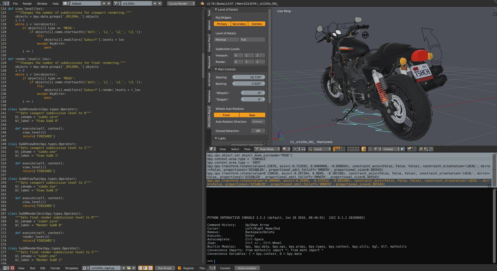
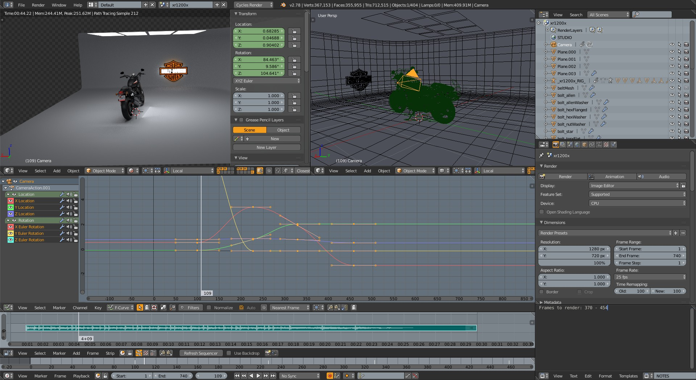
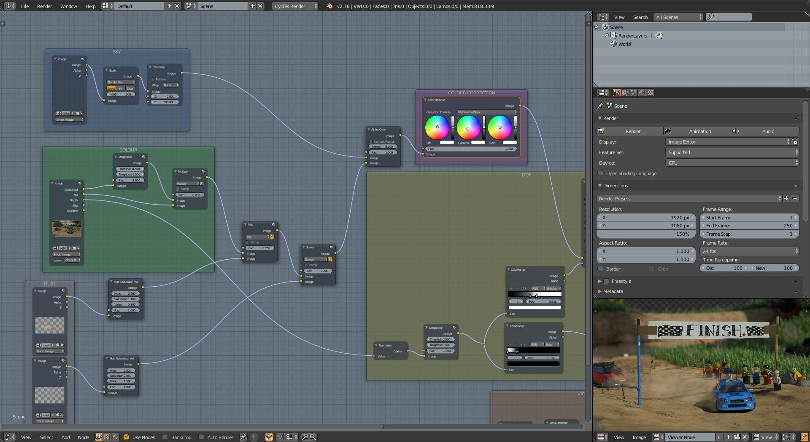
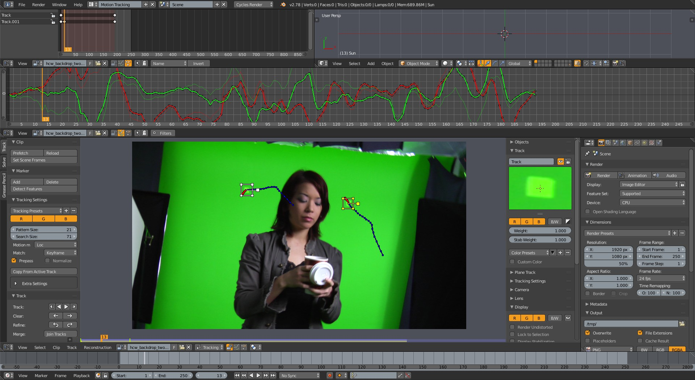

Blender interface theme that tries to mimic Foundry's MODO interface colors. It is based on "official" [Modo theme](https://svn.blender.org/svnroot/bf-extensions/contrib/py/scripts/addons/presets/interface_theme/modo.xml "Modo theme on Blender Wiki"), but heavily modified, hence the name MOMO (**MO**dified **MO**do).

## Some screenshots

