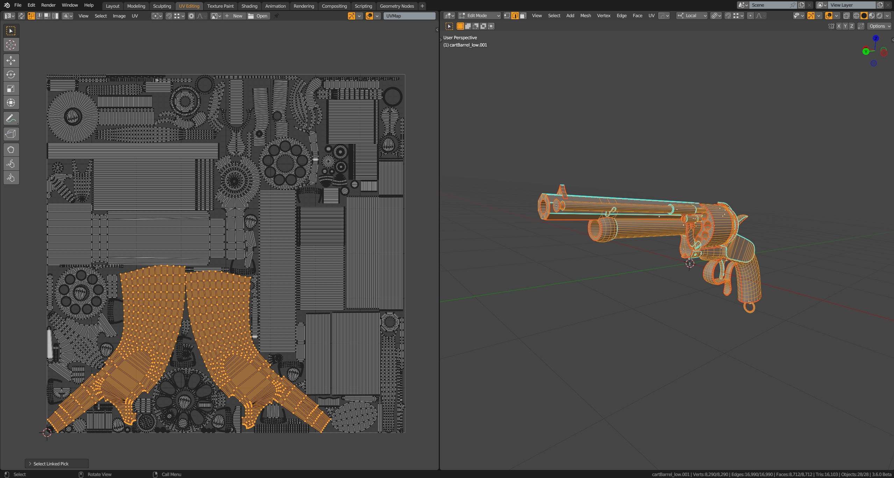
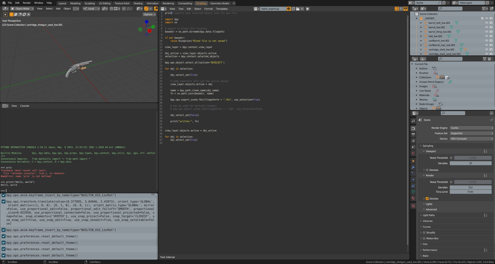

## MOMO v.3.x

The theme inspired by The Foundry's MODO interface colors. The very first version (for Blender 2.7x) was based on "official" [Modo theme](https://svn.blender.org/svnroot/bf-extensions/contrib/py/scripts/addons/presets/interface_theme/modo.xml "Modo theme on Blender Wiki"), but was heavily modified, hence the name MOMO (**MO**dified **MO**do). For Blender 4.x versions.

## Installation
1. Clone or download ZIP
2. (optional) Extract .zip
3. Open Blender User Preferences (Themes tab)
4. Click "Install Theme..." and select __momo.xml__ file

## Some screenshots

