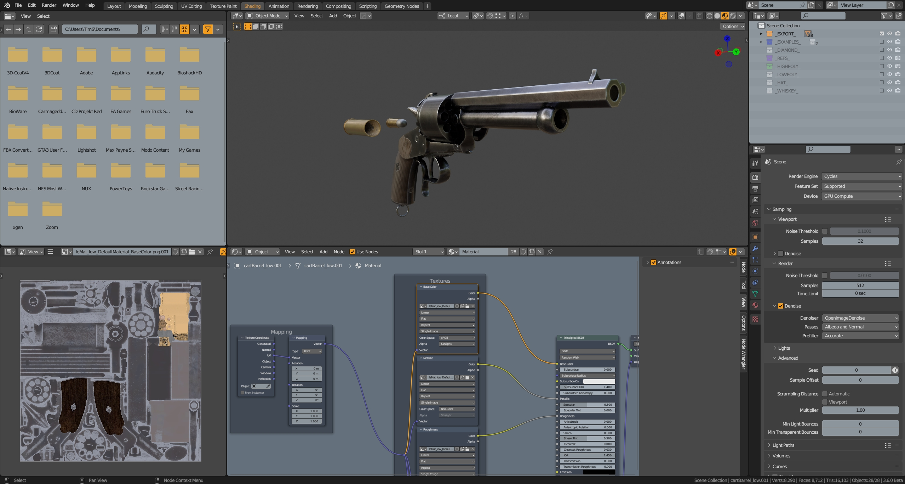
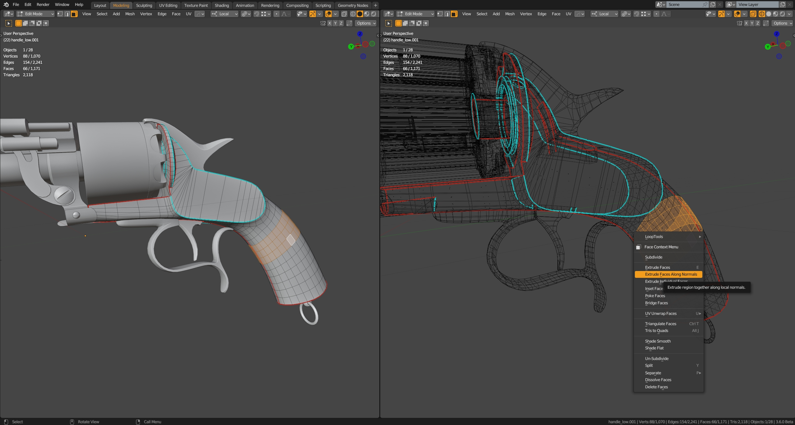

## MOMO v.5.x
(for Blender 5.x)

The theme inspired by The Foundry's MODO interface colors (v16 for light variant, v17 for dark variant). The very first version (for Blender 2.7x) was based on "official" [Modo theme](https://svn.blender.org/svnroot/bf-extensions/contrib/py/scripts/addons/presets/interface_theme/modo.xml "Modo theme on Blender Wiki"), but was heavily modified, hence the name MOMO (**MO**dified **MO**do).

## Installation

This theme is available on Blender's Extensions platform: [Light](https://extensions.blender.org/themes/momo/) or [Dark](https://extensions.blender.org/themes/momo-dark/) (coming soon).

Manual installation:

1. Clone or download ZIP
2. (optional) Extract .zip
3. Open Blender User Preferences (Themes tab)
4. Click "Install..." and select __momo_light.xml__ or __momo_dark.xml__file

## Some screenshots

